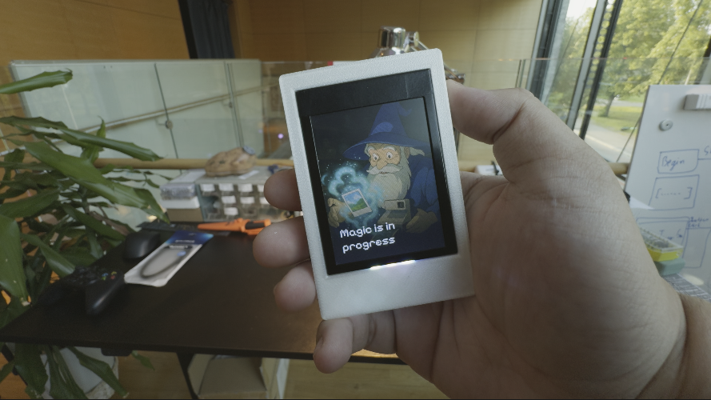
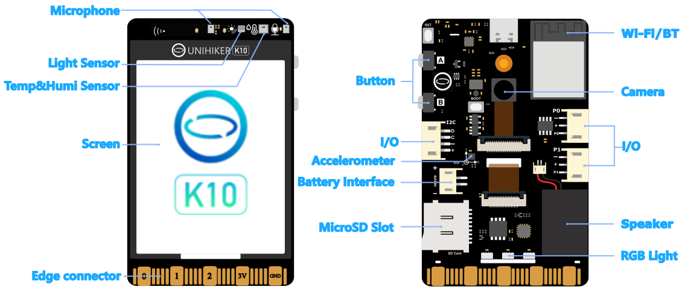

# Build an AI-Powered Polaroid Camera with Unihiker K10



## Introduction

Transform your Unihiker K10 into an AI-powered Polaroid camera that captures photos and applies stunning AI-generated effects in real-time! This project combines the power of Google's Gemini AI and ImageRouter to create a magical photography experience where every shot becomes a work of art.

The device features an intuitive interface with physical buttons, RGB lighting effects, and a shake-to-capture mechanism that makes photography feel natural and engaging. When you take a photo, it's automatically processed through AI to create unique artistic interpretations.

## What You'll Build

- **AI-Powered Camera**: Takes photos and applies AI-generated artistic effects
- **Interactive Interface**: Physical buttons and shake detection for natural interaction
- **Real-time Processing**: WiFi-connected backend handles AI processing
- **Visual Feedback**: RGB lighting and screen animations guide the user experience
- **3D Printed Enclosure**: Custom housing that makes it feel like a real Polaroid camera

## Hardware Requirements



- **Unihiker K10** - The main development board ([Purchase here](https://www.unihiker.com/products/k10))
- **3D Printer** - For printing the custom enclosure
- **SD Card** - Minimum 512MB (FAT32 formatted)
- **Computer** - For Arduino IDE and server setup
- **USB Cable** - For programming and power

### About the Unihiker K10

The Unihiker K10 is an AI learning device that integrates:

- 2.8-inch color touchscreen
- Built-in camera
- WiFi and Bluetooth connectivity
- RGB LED lights
- Accelerometer (for shake detection)
- Speaker and microphone
- Temperature, humidity, and light sensors
- Edge connectors for additional sensors

## Software Requirements

- **Arduino IDE** - For firmware development
- **Python with uv package manager** - For the AI backend server
- **Google Gemini API Key** - For AI image processing
- **ImageRouter API Key** - For additional image effects

## Step 1: Hardware Assembly

### 3D Printing the Enclosure

The project includes three main 3D printed components:

1. **Body** - Main housing for the Unihiker K10
2. **Back Plate** - Covers the back (choose with or without screws)
3. **Button** - Interactive button component

**Printing Settings:**

- **Material**: PLA or PETG recommended
- **Infill**: 15% for all parts
- **Support**: Enable for overhangs
- **Layer Height**: 0.2mm for good quality
- **Orientation**: Print body with large flat side down

**Assembly Steps:**

1. Insert the button into the holes on the side first
2. Place the Unihiker K10 into the body, aligning the Type-C port with its hole
3. Attach the back plate to the back of the device
4. Insert the SD card (must be done before powering on)

## Step 2: Software Setup

### Arduino IDE Configuration

1. **Install Arduino IDE** if you haven't already
2. **Set up Unihiker K10 board support**:

   - Follow the [official Unihiker documentation](https://www.unihiker.com/wiki/K10/get-started/#unihiker-k10)
   - Note: If you encounter documentation bugs, check for updated board packages

3. **Open the Polaroid Project**:
   - Open Arduino IDE
   - Go to **File** → **Open**
   - Navigate to `projects/polaroid/`
   - Select `polaroid.ino`

### WiFi Configuration

1. **Open `wifi_helper.ino`** in your project
2. **Update WiFi credentials**:
   ```cpp
   const char *WIFI_SSID = "YOUR_WIFI_NETWORK_NAME";
   const char *WIFI_PASSWORD = "YOUR_WIFI_PASSWORD";
   ```
3. **Save the file**

### Server IP Configuration

1. **Open `gen_ai_helper.ino`**
2. **Update the server URL** with your computer's IP address:
   ```cpp
   const char *SERVER_URL = "http://YOUR_COMPUTER_IP:8000/upload_adv";
   ```

**To find your computer's IP:**

- **Windows**: Run `ipconfig` in Command Prompt
- **Mac/Linux**: Run `ifconfig` or `ip addr` in Terminal
- Look for your local network IP (usually starts with `192.168.` or `10.`)

## Step 3: Backend Server Setup

### Install uv Package Manager

**Windows:**

```powershell
powershell -c "irm https://astral.sh/uv/install.ps1 | iex"
```

**macOS/Linux:**

```bash
curl -LsSf https://astral.sh/uv/install.sh | sh
```

### Set Up API Keys

1. **Navigate to the server directory**:

   ```bash
   cd projects/polaroid/server
   ```

2. **Copy the environment template**:

   ```bash
   cp .example.env .env
   ```

3. **Edit the `.env` file** with your API keys:
   ```
   GEMINI_API_KEY=your_actual_gemini_api_key_here
   IMAGEROUTER_API_KEY=your_actual_imagerouter_api_key_here
   ```

### Getting API Keys

**Google Gemini API:**

1. Go to [Google AI Studio](https://aistudio.google.com/)
2. Sign in with your Google account
3. Click "Get API key" or navigate to API keys section
4. Create a new API key
5. Copy and paste it in your `.env` file

**ImageRouter API:**

1. Go to [ImageRouter](https://imagerouter.io/)
2. Sign up for an account
3. Navigate to your API keys section
4. Generate a new API key
5. Copy and paste it in your `.env` file

### Start the Server

1. **Run the server**:

   ```bash
   uv run main.py
   ```

2. **Verify it's working** by opening your browser to:
   ```
   http://localhost:8000/docs
   ```
   This shows the FastAPI documentation interface where you can test endpoints.

## Step 4: SD Card Setup

### Prepare the SD Card

1. **Format your SD card** as FAT32
2. **Copy storage files**:
   - Copy the entire contents of the `storage/` directory to the root of your SD card
   - Ensure the folder structure is preserved
3. **Insert the SD card** into the Unihiker K10 before powering on

**Required files for Polaroid project:**

- `storage/polaroid/` - UI images (begin.jpg, loading.jpg, shake.jpg)
- `storage/shutter.wav` - Camera shutter sound
- `storage/loading.wav` - Processing sound

## Step 5: Upload the Firmware

### Compile and Upload

1. **Connect your Unihiker K10** to your computer via USB
2. **Select the correct board**:
   - Go to **Tools** → **Board** → **Unihiker K10**
3. **Select the correct port**:
   - Go to **Tools** → **Port** → Select where your device appears
4. **Upload the code**:
   - Click the **Upload** button (→ arrow icon) or press **Ctrl+U** (Windows/Linux) or **Cmd+U** (Mac)
5. **Wait for completion** - The device will restart automatically

## Step 6: Testing Your AI Polaroid Camera

### Power On and Test

1. **Power on your device** - It should show the "begin" screen
2. **Verify WiFi connection** - The device should connect to your network
3. **Test the camera** - Press Button A to start camera mode

### Using the Camera

**Basic Operation:**

1. **Start**: Press Button A to enter camera mode
2. **Capture**: Press Button A again to take a photo
3. **Processing**: Watch the loading animation while AI processes your image
4. **Shake to Reveal**: Shake the device to see the AI-generated result
5. **Compare**: Press Button B to toggle between original and AI-processed images
6. **New Photo**: Press Button A to take another photo

**Visual Feedback:**

- **RGB Lights**: Purple/blue waves during loading, white flashes during shake
- **Screen States**: Different images guide you through each step
- **Sound Effects**: Shutter sound when capturing, loading sound during processing

## Step 7: Understanding the Code Structure

### Main Components

**`polaroid.ino`** - Main firmware file:

- State machine management
- Button handling
- Screen transitions
- RGB light control

**`camera_helper.ino`** - Camera functionality:

- Camera initialization and display
- Image capture and saving
- Integration with AI processing

**`file_helper.ino`** - File system operations:

- Photo numbering system
- Directory creation
- SD card management

**`gen_ai_helper.ino`** - AI integration:

- HTTP communication with server
- Image upload and download
- Error handling

### State Machine

The device operates through these states:

1. **BEGIN** - Initial welcome screen
2. **SHOW_CAMERA_FEED** - Live camera preview
3. **LOADING** - AI processing with animated feedback
4. **SHAKE** - Prompt to shake for reveal
5. **SHOW_GEN_AI_IMAGE** - Display AI-processed result
6. **SHOW_ORIGINAL_IMAGE** - Show original photo (toggle with Button B)

## Troubleshooting

### Common Issues

**Device won't turn on:**

- Check SD card insertion
- Verify power connection
- Try different USB cable

**WiFi connection fails:**

- Double-check SSID and password in `wifi_helper.ino`
- Ensure 2.4GHz WiFi network (5GHz may not work)
- Check device proximity to router

**Server connection fails:**

- Verify IP address in `gen_ai_helper.ino` matches your computer
- Ensure server is running (`uv run main.py`)
- Check firewall settings
- Confirm both devices are on same network

**Photos not saving:**

- Check SD card free space
- Verify FAT32 formatting
- Ensure all required files are copied

**3D printed parts don't fit:**

- Check printer calibration
- Try back plate with screws if friction fit is loose
- Adjust print settings for better accuracy

### Debug Tips

1. **Check Serial Monitor** in Arduino IDE for error messages
2. **Verify API keys** are correctly set in `.env` file
3. **Test server endpoints** using the FastAPI docs interface
4. **Check file permissions** on the SD card

## Customization Ideas

### Hardware Modifications

- **Custom Back Plates**: Design your own back plate with different patterns
- **Additional Sensors**: Add environmental sensors for context-aware effects
- **External Buttons**: Connect custom buttons for different functions
- **Speaker Enhancement**: Add external speaker for better audio

### Software Enhancements

- **Multiple AI Models**: Switch between different AI processing styles
- **Photo Filters**: Add traditional camera filters before AI processing
- **Social Sharing**: Add WiFi upload to social media
- **Photo Gallery**: Browse and manage saved photos
- **Custom Effects**: Create your own image processing algorithms

### UI/UX Improvements

- **Custom Animations**: Design your own loading and transition animations
- **Sound Design**: Create custom audio feedback for different actions
- **Haptic Feedback**: Add vibration patterns for different states
- **Voice Commands**: Integrate voice control for hands-free operation

## Conclusion

Congratulations! You've successfully built an AI-powered Polaroid camera that combines the nostalgia of instant photography with cutting-edge AI technology. This project demonstrates how modern hardware platforms like the Unihiker K10 can be used to create engaging, interactive experiences that bridge the gap between traditional photography and AI-powered creativity.

The modular design of this project makes it easy to experiment with different AI models, add new features, or adapt it for other creative applications. Whether you're interested in computer vision, IoT development, or just want to create something unique, this project provides a solid foundation for further exploration.

### Next Steps

- **Experiment with different AI models** and processing styles
- **Add more interactive features** like gesture recognition
- **Create a photo gallery** with cloud storage integration
- **Build a companion mobile app** for remote control and sharing
- **Explore other Memento project variants** like the Film, Locket, or Memory-cue projects

### Resources

- [Unihiker K10 Documentation](https://www.unihiker.com/wiki/K10/)
- [Google Gemini API Documentation](https://ai.google.dev/)
- [ImageRouter API Documentation](https://imagerouter.io/)
- [FastAPI Documentation](https://fastapi.tiangolo.com/)
- [Project Repository](https://github.com/your-repo/memento)

Happy building and happy snapping! 📸✨
